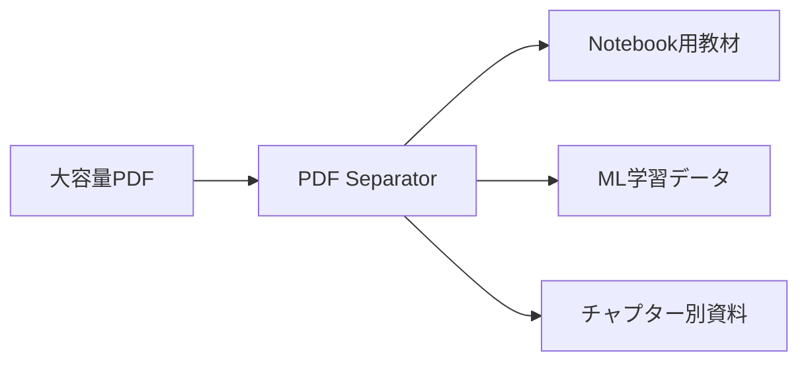

# 🎯 PDFlex

> 📚 Flexible PDF Splitter for AI Learning Materials

[](https://www.python.org/downloads/)
[](https://streamlit.io/)
[](https://opensource.org/licenses/MIT)

大容量PDFファイルを効率的に分割するためのオープンソースツール。
特にAI学習教材や技術文書の分割に最適化されています。

## ✨ 主な機能

| 機能 | 説明 |
|------|------|
| 🚀 大容量PDF対応 | 200MB以上の大規模PDFファイルも処理可能 |
| 📊 柔軟な分割 | ページ数を指定して自由に分割 |
| 💾 効率的なメモリ管理 | ストリーム処理による最適化 |
| 📈 進捗表示 | リアルタイムの処理状況表示 |
| 🔄 バッチ処理 | 複数ファイルの一括処理に対応 |

## 🎯 ユースケース

### AI学習教材の準備
- 📘 Jupyter Notebook用の教材分割
- 🤖 機械学習モデルの学習データセット作成
- 📚 技術文書のチャプター分割

### 活用シーン


## 🚀 インストール方法

```bash
# リポジトリのクローン
git clone https://github.com/yourusername/pdflex.git
cd pdflex

# 依存パッケージのインストール
pip install -r requirements.txt
```

## 💻 使用方法

```bash
# 基本的な使用方法
streamlit run app.py -- path/to/your/file.pdf

# 例：
streamlit run app.py -- "./materials/large_document.pdf"
```

## 🔧 技術仕様

| コンポーネント | 説明 |
|--------------|------|
| フロントエンド | Streamlit |
| PDF処理 | PyPDF2 |
| メモリ管理 | 最適化されたストリーム処理 |
| 進捗管理 | Streamlitプログレスバー |

## 🌟 特徴的な実装

- ストリーミング処理による大容量ファイル対応
- メモリ使用量の最適化
- エラーハンドリングの強化
- 直感的なUI/UX

## 📈 パフォーマンス

| ファイルサイズ | 処理時間 | メモリ使用量 |
|--------------|---------|------------|
| 〜100MB | 数秒 | 〜500MB |
| 100MB-300MB | 10-30秒 | 〜1GB |
| 300MB以上 | 30秒以上 | 1GB-2GB |

## 🤝 コントリビューション

プロジェクトへの貢献を歓迎します！以下の方法で参加できます：

- 🐛 バグ報告
- 💡 新機能の提案
- 📝 ドキュメントの改善
- 🔧 コードの改善

## 📄 ライセンス

MITライセンスの下で公開されています。詳細は[LICENSE](LICENSE)ファイルをご覧ください。

## 📞 サポート

- Issue Trackerで問題を報告
- Pull Requestsで改善を提案
- Discussionsでアイデアを共有

---

Made with ❤️ for AI learners and educators

---
**PDFlex**: _PDF + Flexible = AI学習のための柔軟なPDF処理ツール_
# PDFlex
